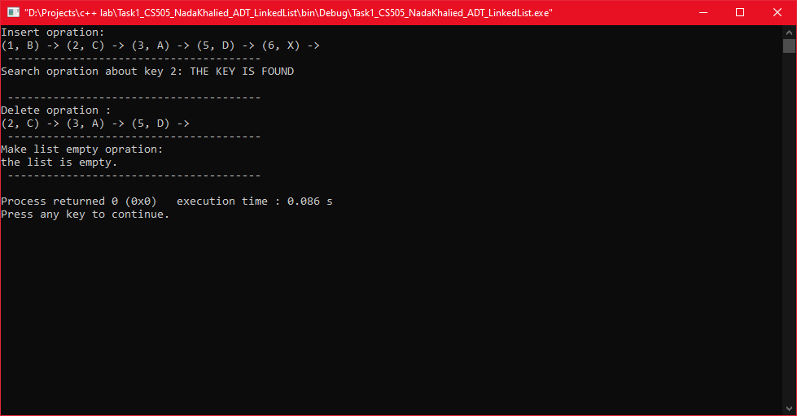
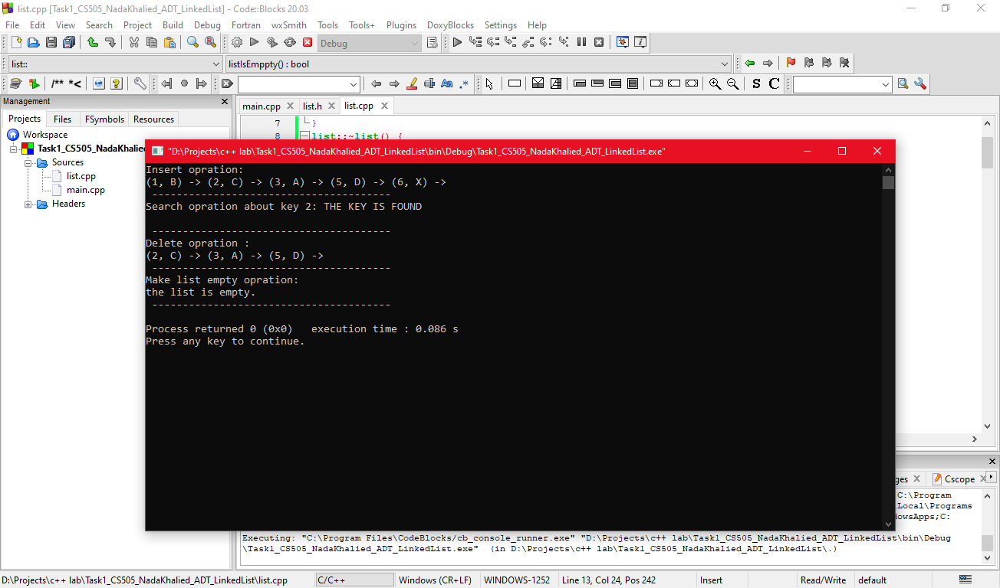

# ADT Linked List  

This project is a C++ implementation of a **singly linked list** using an **Abstract Data Type (ADT)** approach. It demonstrates various operations on a linked list such as insertion, deletion, traversal, searching, and ordered insertion by key.
## Overview

A **Linked List** is a linear data structure where elements, called **nodes**, are linked using pointers.  
Each node contains:
- A **key** (for searching and ordering)
- **Data** (the value associated with the key)
- A pointer to the **next node**

The list maintains three pointers internally:
- **head**: points to the first node
- **cursor**: points to the current node
- **prev**: points to the previous node

This implementation is designed to show how an ADT Linked List works behind the scenes, giving hands-on understanding of dynamic memory, node manipulation, and list traversal.

---

The linked list supports:

- Creating an empty list
- Checking if the list or current position (cursor) is empty
- Moving the cursor to the first or last node
- Advancing the cursor to the next node
- Updating data and key values of the current node
- Retrieving data and key values
- Inserting nodes at the beginning, after, before, or at the end
- Deleting nodes (first, last, or current)
- Making the list empty
- Searching for a node by key
- Ordered insertion based on key
- Traversing the list to display all nodes
## Features

1. **Create an empty list**
2. **Insert nodes**:
   - `insertFirst(key, data)`: insert at head
   - `inserAfter(key, data)`: insert after current
   - `inserbefore(key, data)`: insert before current
   - `inserEnd(key, data)`: insert at end
   - `orderInsert(key, data)`: insert while keeping keys sorted
3. **Delete nodes**:
   - `deleteNode()`: delete current node
   - `deletefrist()`: delete first node
   - `deletend()`: delete last node
   - `makelistempty()`: delete all nodes
4. **Search node** by key
5. **Update data or key** for current node
6. **Traverse** the list to display all nodes
7. **List information**:
   - `listSize()`: number of nodes
   - `atFirst()`: check if cursor is at head
   - `atEnd()`: check if cursor is at tail
   - `listIsEmpty()`: check if list is empty
   - `cursorIsEmpty()`: check if cursor is null
---

## Example Output

The output shows the operations in action, including insertion, search, deletion, and clearing the list.
---
## Future Development

Potential improvements and extensions for this project:

- **Doubly Linked List**: add a `prev` pointer for backward traversal.

- **Generic Templates**: allow different data types instead of `char` and `int`.

- **Linked List Sorting & Merging**: implement functions to sort or merge multiple lists.

- **File I/O**: save and load linked lists from files.

- **Graphical Representation**: visualize nodes and links for easier understanding.
---

This project was written by **Nada Al-Eaqrab** as an application of the **ADT Linked List** concept.
